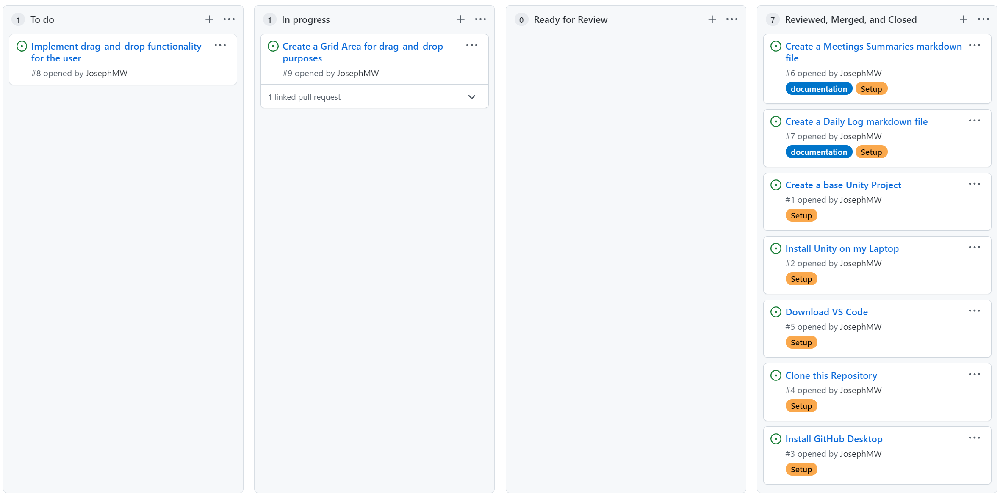
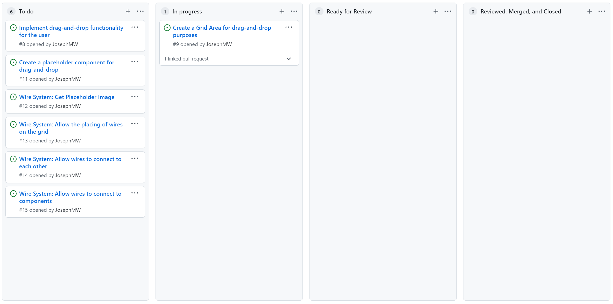
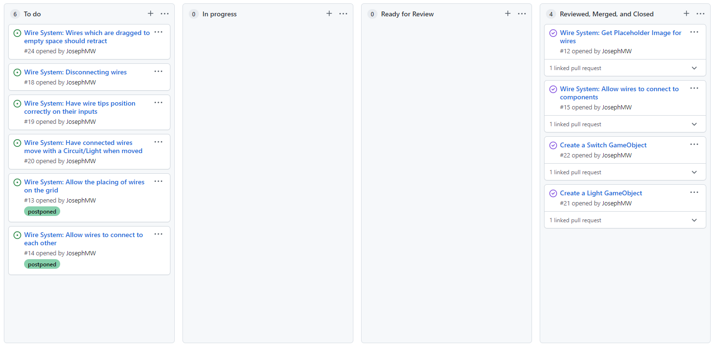
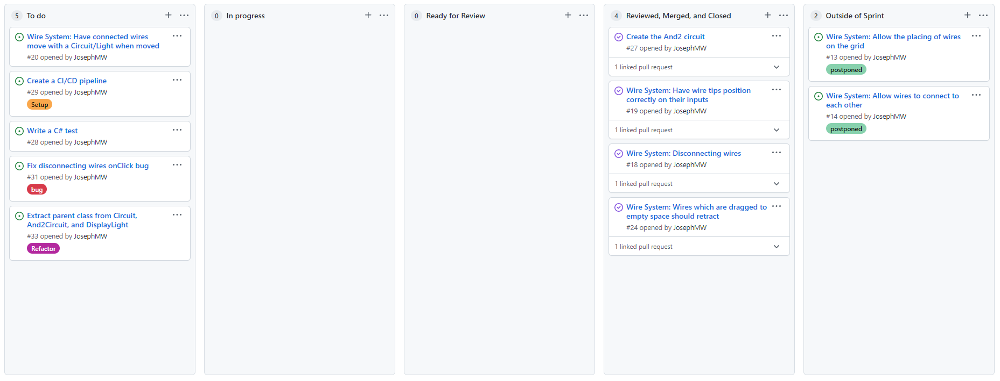
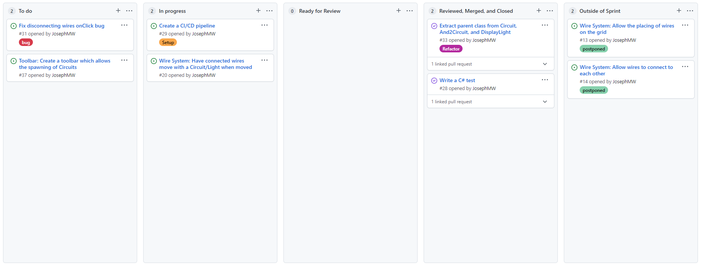
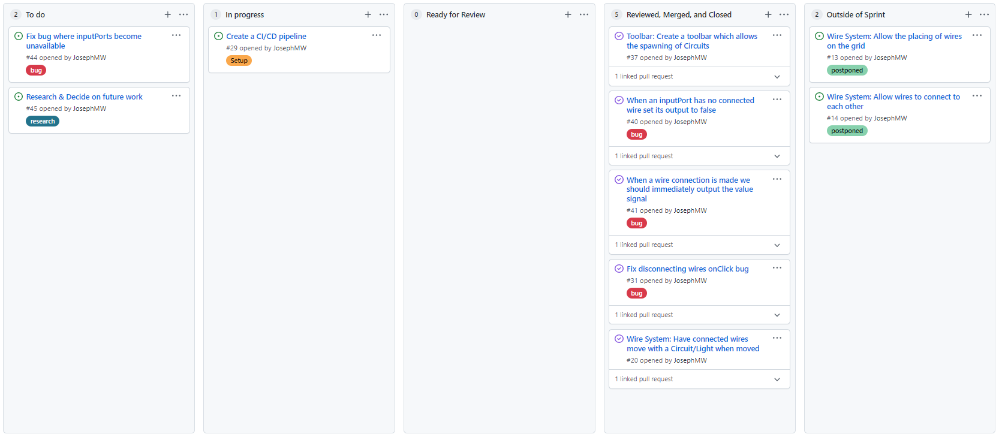

# Meetings Summaries

This file contains summaries of all the advisor meetings throughout the course of my project.

[Link back to README](../README.md)

## 01/10/21 - Weekly Supervisor Meeting
What we spoke about:
*	My idea of the project:
    +	Have a very user-friendly UI
    +	Use Drag-and-drop components
    +	Allow user to build components (As a means of abstraction)
    +	Allow user to manually draw wires (Like train-tracks)
    +	Stretch Goals for my project:
        -	Tutorial Overlay that guides a pupil to build something
        -	Use levels which accumulate to a student having a complex circuit
    +	Technologies I will use:
        -	Unity (C#)
        -	GitHub
        -	VS Code
*	What we want from the project:
    +	Have a relatively polished item that you can use when talking to school pupils about the university

Goals for next time:
*	Consolidate Technologies
*	Begin learning Unity
    +	Ideally get a start on the project – perhaps a grid with drag-and-drop items
*	Set up dev tools such as GitHub
*	Set up documentation and share it with Chris McCaig

  

## 08/10/21 - Weekly Supervisor Meeting
Progress I’ve made:
*	Created private GitHub which you now have access to
    +	https://github.com/JosephMW/Logic-Gates-Educational-Game
*	Created 2D Unity project
*	Written some very minor C# in Unity to make a start (Part of the grid-layout system)
*	Using Mendeley as a reference manager
*	Wrote Documentation that can be found on GitHub:
    +	Daily Logs
    +	Meeting Summaries
    +	Exported .bib references file from my private Mendeley.
    +	Issue Tracking & Branching Strategy
*	Did general research into Unity.

Project Board after the first week:

 
 
What we spoke about:
*	The progress I have made (found above)
*	Whether weekly/biweekly retrospectives could be beneficial
    +	Concluded yes
*	Whether User Testing could be beneficial, and worth the bother of ethics etc.
    +	Concluded yes. I would not be working with under 16s and it would be voluntary and non-dangerous so the ethics process would be simple. 
*	My goals for the next week (found below)
 
Goals for next time:
*	Complete my 2 ongoing issues
    +	Create a grid area for drag-and-drop purposes [#9](https://github.com/JosephMW/Logic-Gates-Educational-Game/issues/9)
    +	Implement drag-and-drop functionality on top of this grid area [#8](https://github.com/JosephMW/Logic-Gates-Educational-Game/issues/8)
*	Create a placeholder component for the drag-and-drop
*	Begin work on the wire system
    +	Get placeholder image for them
    +	Allow the placing of wires on the grid
    +	Allow wires to connect to each other
    +	Allow wires to connect to components?

Project Board for the next week:

## 14/10/21 - Weekly Supervisor Meeting
Progress I’ve made:
*	Completed my CustomGrid, which has the following functionality:
    +   Renders a 2D grid of partially separated squares.
    +   Takes 3 params: width, height, cellSize.
    +   Linear transformation takes the grid and ensures the center of the grid aligns with the game plane.
*   Made progress with Drag-and-Drop:
    +   I now have the functionality of being able to drag-and-drop a component on screen.
    +   I still need to have a dropped sprite snap into position on the CustomGrid which sits behind.
 
What we spoke about:
*	The progress I have made (found above)
*   The struggles I have had with development
    +   I don't have wifi in my flat yet which is slowing things.
    +   I need to learn the key Unity Architecture and styles of coding before continuing
        -   It has become clear there are styles of programming in Unity, you can instantiate components, or use AddComponent and give reference to other GameObjects. I need to learn the key details in these approaches and become consistent for the rest of the project. We both expect issues will arise if I try to combine different approaches. 
*	My goals for the next week (found below)
 
Goals for next time:
*   Learn about Unity Architecture, and using AddComponent etc to avoid directly instantiating classes via constructors.
*	Complete Drag-and-Drop
    +   Have sprites snap into position on the grid.
*   Complete other outstanding issues on the Project Board
    +   Wire System: Get Placeholder Image
    +   Wire System: Allow the placing of wires on the grid
    +   Wire System: Allow wires to connect to each other
    +   Wire System: Allow wires to connect to components

**KEY DECISION** *At this point in the project I felt confusion as to how I organised my work. I had decided to use week-long sprints at the beginning as I thought it would work well with weeekly meetings - however I failed to consider that weekly supervisor meetings may not always occur on the same day and same time. Therefore, I cannot ensure that a supervisor meeting always occurs at the end of a sprint. I now realise I need a concrete start and end to each sprint, and supervisor meetings will have to sometimes occur mid-sprint.*
*We now have three things which occur weekly: My sprints; My supervisor meetings; The university 'Weeks'. In order to save confusion over these three different things I have decided to organise my sprints to align with the university 'Weeks' - that being start on Monday and end on Sunday. My Supervisor meetings will just occur when my supervisor is available.*

## 20/10/21 - Weekly Supervisor Meeting
Progress I’ve made:
*	Completed Drag-and-Drop functionality:
    +   I now have the functionality of being able to drag-and-drop a component and have a dropped sprite snap into position on the CustomGrid which sits behind.
*	Began work on Wire System
    +   I have a prefab for a Wire.
    +   I have begun working on the logic for a wire
    +   I have decided to first build a simple version of the wires and later polish them.

What we spoke about:
*	The progress I have made (found above)
*	How important testing is in my project
    +   Should definitely do some, but doesn’t need to be huge.
    +   I will write C# tests for the logic.
*	My goals for the next week (found below)

Goals for next time:
*	Complete the rudimentary wire system. This involves:
    +   Use straight line wires
    +   Connect circuit to circuit visually
    +   Connect circuit to circuit logically (Allow data to be passed from one circuit to another after a wire has been set up)
*	Start writing some C# tests.
*	If I accomplish the above tasks then I will consider adding placeholder input and outputs for the circuits
    +   This could be a button you toggle to select 0 or 1 for the input.
    +   Output could be a light which is lit if it recieves a 1, or off if it recieves a 0.

## 27/10/21 - Weekly Supervisor Meeting
Progress I’ve made:
*	Created Circuit prefab
*	Created Switch prefab (This is used as input to the circuit)
*	Created Light prefab (This is used as output for the circuit)
*	Created Wire system which works visually and logically – we can now join components using wires and pass signals through the circuit.

What we spoke about:
*	The progress I have made (found above)
*	It may be worthwhile keeping consistent notes of how elements work as I write them – perhaps a short readme on each component?
*	Could be worth reading some academic literature on relevant projects.
*	The difficulties in which keeping state could introduce
    +   If we give the user the ability to create custom reusable circuits, how do we do this?
        -   Purely combinational circuits could be easily stored as a look-up-table
        -   If we allow state (flip flops) then a look-up-table wouldn’t work.
*	My goals for the next week (found below)

Goals for next time:
1.	Complete final details surrounding Wire System:
    +   Ability to disconnect a previously connected wire.
    +   Have a wire retract to its start point if when dragged you do not connect it to anything.
2.	Start writing tests:
    +   Ideally run these in GitHub Actions (Or a similar system) to test each branch before merging.
    +   These tests will cover the C# logic I am writing
3.	Create multiple input circuits:
    +   Create a real functioning And2 circuit.
    +   Create other circuits if I have time, perhaps: Or2, Xor2, Inv, etc.

## 03/11/21 - Weekly Supervisor Meeting
Progress I’ve made:
1.	Wires which are not connected to input ports now retract to where they started
2.	You can now disconnect wires
3.	Wires position correctly when connected to input ports now
4.	I have created the And2 circuit
    +   This circuit takes 2 inputs
    +   Has 1 output
    +   Output is equal to (input1 && input2)

What we spoke about:
*	The progress I have made (found above)
*	Reading the marking scheme carefully could benefit me – so I know I am working well.
*	We discussed the workload of a joint-honours student on this project.
*	My goals for the next week (found below)

Goals for next time:
*	Make it so when dragging a circuit with connected wires, those wires move appropriately.
*	Add CI/CD Pipeline and some tests.
*	Refactor some code.
    +   Extract parent class for Circuit, And2Circuit, DisplayLight. 
*	If I complete the above in time then work on adding a toolbar which allows the user to spawn premade components.

**KEY DECISION** *As visibile in the above screenshot, I decided to add a fifth column to my project board. This column is 'Outside of Sprint' and will be used to hold issues which are not currently being worked on but are future work.*

## 10/11/21 - Weekly Supervisor Meeting
Progress I’ve made:
*	I have set up the Unity Test Runner which allows me to test my Unity components in live scenes – allowing testing which is closer to playing the game.
*	I have written a set of tests for my And2Circuit which run in a live scene.
*	I have refactored Circuit, And2Circuit, and DisplayLight to using a parent class which defines almost all behaviour for these classes.
    +   This proved more complex than previously anticipated as I decided to refactor a good chunk of the code. My new version is now much more extensible and should allow me to create almost any circuit I would like easily – up to holding state.
    +   Creating new combinational circuits such as Or-gates, larger and-gates, mux, demux, inv, etc should now be trivial.
*	I have made progress on a CI/CD pipeline however it is proving difficult
    +   I have a GitHub action set up (This is just a script which runs on every push to a branch and every pull request)
    +   I have the Unity Test Runner GitHub Action mostly setup but it fails before the tests can execute. 
        -   The technology I am using for this is relatively new so there are few forums about it/there isnt much documentation. This is why it is proving difficult.

What we spoke about:
*	The progress I have made (found above)
*	We discussed how we would store a custom circuit which a user has designed
    +   We could generate a truth table from it
        -   Seems very reasonable 
        -   Stores the circuit in a compact way
        -   Does not allow circuits to have state (Flip flops)
    +   We could try to save the entire circuit and somehow give it input and recieve its output
        -   Unsure as to how this would be implemented – needs research.
        -   Stores the circuit in a less compact way
        -   Allows circuits to have state (Flip flops) – this is a big positive.
*	My goals for the next week (found below)

Goals for next time:
*	Finish CI/CD pipeline
*	Make dragging a circuit adjust the position of any connected wires.
*	Fix the small bug surrounding disconnecting wires.
*	Start work on the overlay/toolbar which allows the user to spawn new components.

## 24/11/21 - Weekly Supervisor Meeting
Progress I have made:
*	I have added that when circuits are dragged which have connected wires, those connected wires move appropriately to stay connected
    +   This involved some useful refactorings I had been meaning to do anyways.
*	I fixed the bug I had previously mentioned about difficulty when disconnecting wires
    +   This was due to overlapping colliders, so when you clicked it didn’t know which you were referring to
*	I fixed 2 more minor bugs I found
    +   When we disconnected an ‘ON’ wire, we were previously failing to reset the state to ‘OFF’
    +   When we connected a new wire we were failing to immediately send the value signal in some cases
*	I created the Toolbar which allows you to spawn GameObjects into the world. I added the 4 objects I have made so far to this toolbar

What we spoke about:
*	The progress I have made (found above)
*	We discussed the 3 main future avenues of work:
    +   Improve UI 
        -   I will definitely do this
        -   It is not imminent and may suit being completed near the end of my development phase
    +   User Created Circuits
        -   May cause complications if I also implement ‘Circuits which can hold state’
    +   Circuits which can hold State
        -   May cause complications if I also implement ‘User Created Circuits’
*	My goals for the next week (found below)

Goals for next time:
*	Investigate and Fix bug we discovered where inputPorts do not accept wire connections in certain cases.
*	Finish CI/CD pipeline
*	Research and decide on which of the following two issues I should prioritise for future work.
    +   User Created Circuits
    +   Circuits which can hold state

